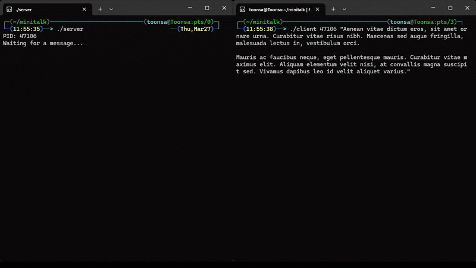
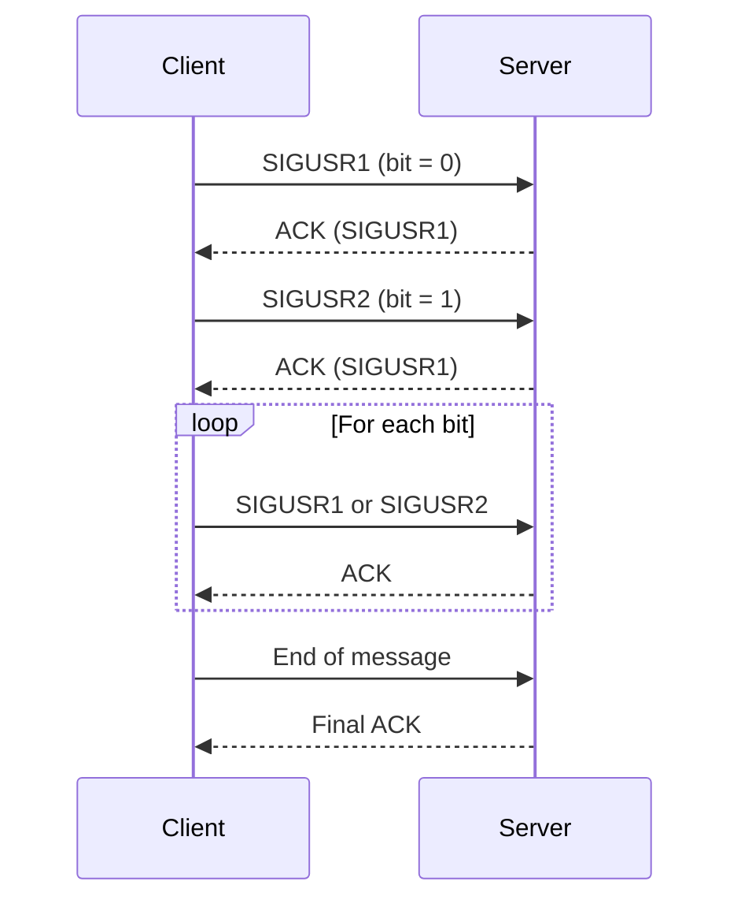

# 🛰️ minitalk – C Unix signals


[](LICENSE)

> **Minitalk** is a 42 project that demonstrates **inter-process communication (IPC)** using **Unix signals** (SIGUSR1, SIGUSR2). The client process encodes messages bit-by-bit, while the server side **acknowledges** each bit to ensure reliable, **synchronous data transfer**.

[🔗 View on GitHub](https://github.com/to0nsa/minitalk)
📚 **[View full documentation](https://to0nsa.github.io/minitalk/)**

---

## ✨ Features

<details>
<summary><strong> See features  </strong></summary>

- **Signal-Based Communication**  
  Transmits data between processes using Unix signals (`SIGUSR1`, `SIGUSR2`).

- **Bit-Level Message Encoding**  
  Converts each character of the message into binary and sends it bit-by-bit.

- **Synchronous Acknowledgment System**  
  Ensures reliable delivery by waiting for the server to acknowledge each bit before sending the next.

- **Robust Signal Handling**  
  Handles asynchronous signal reception with reentrant-safe functions and proper flow control.

- **Custom Protocol Over Signals**  
  Implements a lightweight protocol to distinguish between data bits and end-of-message signals.

- **Minimal Latency Transmission**  
  Optimized signal dispatching and response time to achieve near real-time communication.

- **PID-Based Targeting**  
  The client can dynamically target any server process by providing its PID as an argument.
</details>

---

## 🎬 Demo
> Here's a quick look at how client/server communication works in Minitalk:



---

## ⚙️ How It Works

<details>
<summary><strong> See details  </strong></summary>

**1.** The **server** starts and prints its PID.

**2.** The **client** takes the server PID and a message as input.

**3.** Each character is broken down into bits and sent one bit at a time:
   - `SIGUSR1` represents binary `0`
   - `SIGUSR2` represents binary `1`

**4.** The server rebuilds characters from incoming signals.

**5.** The server sends an acknowledgment after each bit, allowing safe and synchronous transmission.

📡 **Signal Flow** – Sequence Diagram



</details>

---
## 🚀 Usage
<details>
<summary><strong> See usage guide  </strong></summary>

**1. To compile both executables:** 🛠️
```bash
make
```
**Note:** This project uses **[libft](https://github.com/to0nsa/libft)** as a git submodule.
If you're cloning the repository for the first time, don't forget to initialize and update submodules:
```bash
git clone --recurse-submodules https://github.com/to0nsa/minitalk.git
```
or if you already cloned it:
```bash
git submodule update --init --recursive
```

**2. Run the server**
Start the server in one terminal. It will print its Process ID (PID):
```bash
./server
PID: <PID>
Waiting for a message...
```

**3. Run the client**
Use the PID from the server output to send a message:
```bash
./client <PID> "Your message here"
```

🔄 **Expected behavior**
- The server will print each received character in real time.
- The client will wait for an acknowledgment from the server after each bit to ensure safe delivery.

</details>

---
## 🗂️ Project Structure
<details>
<summary><strong> See project structure  </strong></summary>

```txt
minitalk/
├── include/         # Header file with function prototypes, librairies...
├── srcs/            # client.c / server.c /utils.c
├── libft/           # Custom C library - git submodule
├── objs/            # Object files (auto-generated)
└── Makefile         # Clean, silent build system with useful targets
```
</details>

---
## 📝 License

This project is licensed under the [MIT License](LICENSE).

You are free to use, modify, and distribute this code for academic, personal, or professional purposes. Attribution is appreciated but not required.

---

## 📬 Contact

If you have any questions, suggestions, or feedback, feel free to reach out:

- **📧 Email:** nicolas.lovis@hotmail.fr
- **💻 GitHub:** [github.com/to0nsa](https://github.com/to0nsa)

You're also welcome to open an issue or leave a comment on the repository.
